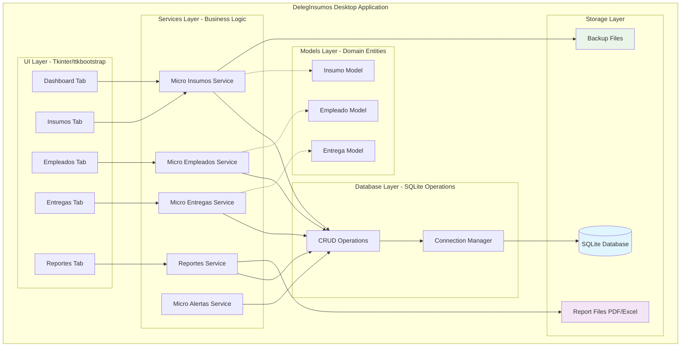
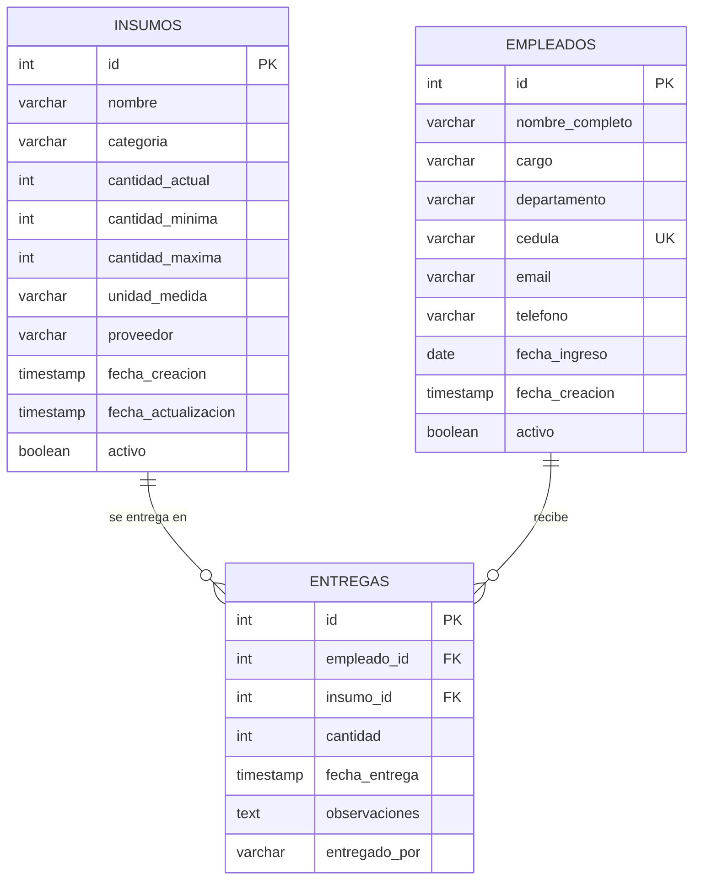
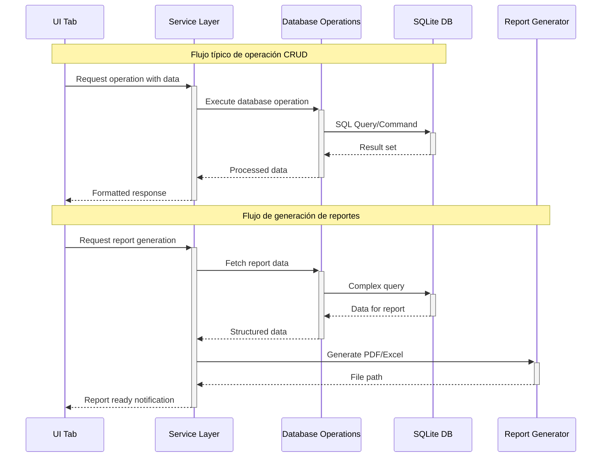
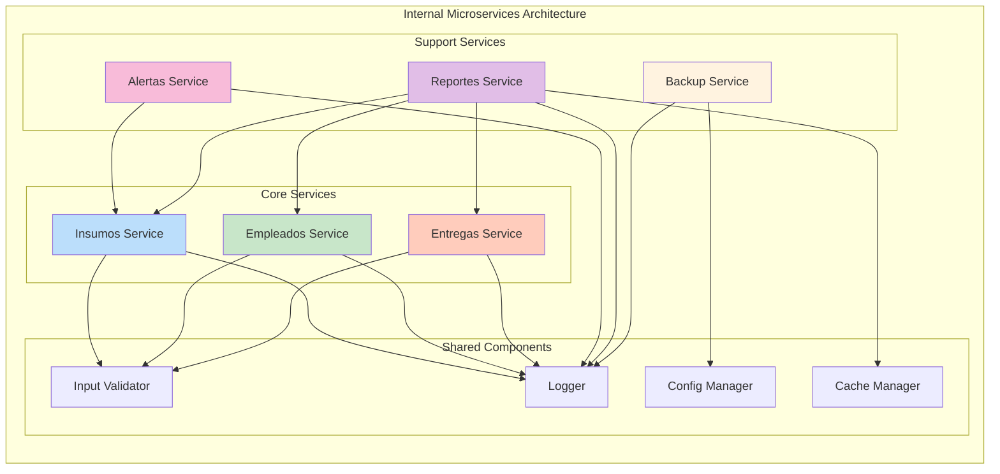
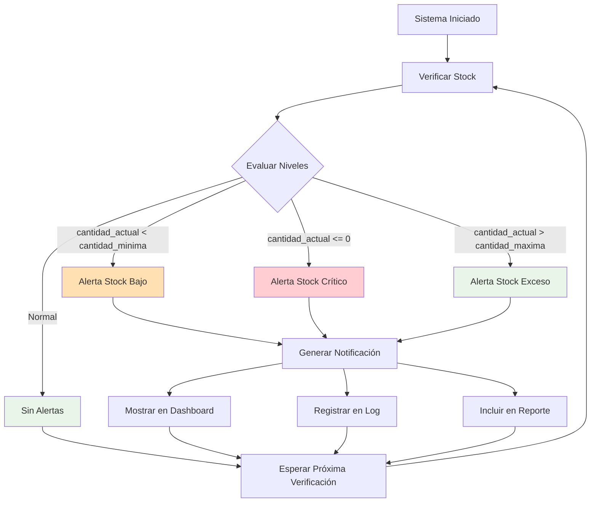
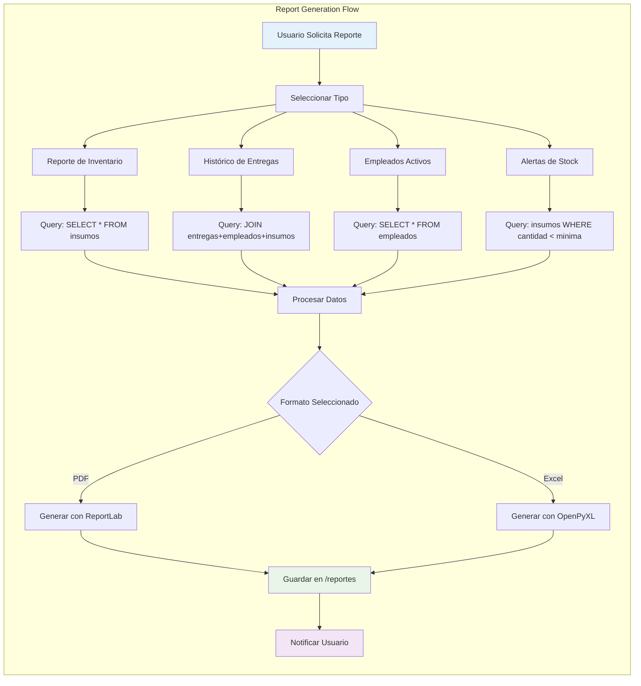
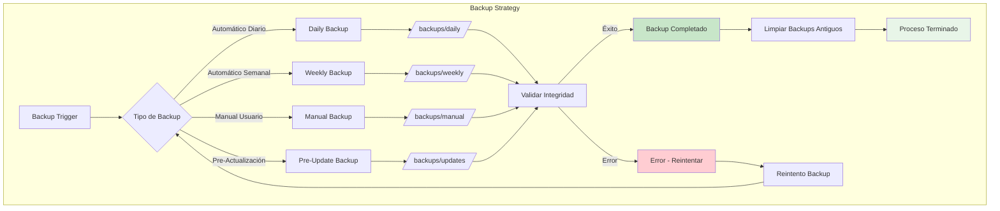

# DelegInsumos - Diagramas Arquitectónicos

## 1. Arquitectura General del Sistema

## 2. Esquema de Base de Datos Relacional

## 3. Flujo de Comunicación entre Componentes

## 4. Arquitectura de Microservicios Internos

## 5. Sistema de Alertas y Notificaciones

## 6. Flujo de Generación de Reportes

## 7. Arquitectura de Backup y Recuperación

---

## Notas Técnicas de los Diagramas:

### Leyenda de Colores:
- **Azul claro**: Componentes de UI y entrada de usuario
- **Verde claro**: Procesos exitosos y estados normales
- **Naranja claro**: Alertas y advertencias
- **Rosa claro**: Errores y estados críticos
- **Violeta claro**: Procesos de salida y reportes

### Convenciones:
- **Líneas sólidas**: Flujo de datos principal
- **Líneas punteadas**: Dependencias o referencias
- **Flechas gruesas**: Procesos críticos del sistema
- **Subgrafos**: Agrupación lógica de componentes relacionados

### Patrones Arquitectónicos Implementados:
1. **Layered Architecture**: Separación clara entre UI, Services, Database
2. **Repository Pattern**: Encapsulación del acceso a datos
3. **Service Layer**: Lógica de negocio centralizada
4. **Event-Driven**: Sistema de alertas basado en eventos
5. **Strategy Pattern**: Múltiples formatos de reporte